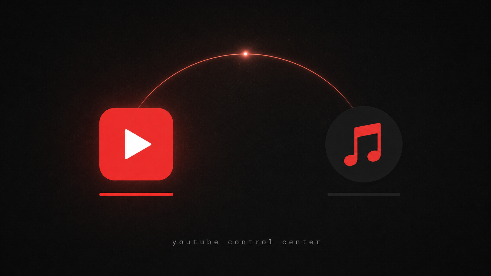
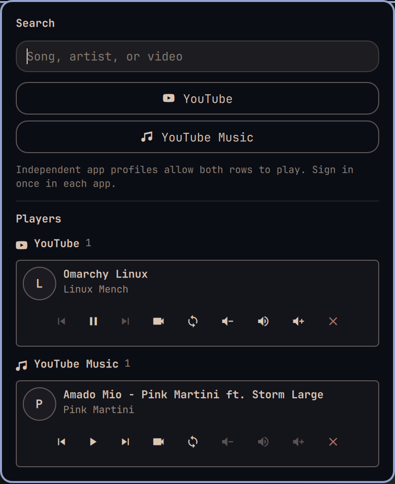

# Tube Control

YouTube and YouTube Music finally behave like two real desktop players—not two tabs fighting over the same controls.

A fork of [janooh37-hue/omarchy-youtube-control-center](https://github.com/janooh37-hue/omarchy-youtube-control-center) that launches your own default browser (already signed in) instead of a separate, isolated Chromium profile.





## What makes it different

- **Keep both worlds separate.** YouTube and YouTube Music each get their own app window and player row, from your existing default-browser sign-in. A paused video never disappears just because music started.
- **Hand off instead of hunting tabs.** One button starts the player you want and pauses every other player, so switching from a video to music never creates overlapping audio.
- **Change the player, not the whole desktop.** Volume and mute controls target the exact YouTube or Music stream while system volume stays untouched.
- **Jump straight to the right window.** Bring a player's video to the front—or close only that player—without guessing which Chromium window owns the sound.
- **Search where you mean to listen.** Type once, then send the query directly to YouTube or YouTube Music.
- **Uses your own browser.** Opens whichever browser is set as your desktop default, so it's already signed in — no separate profile, no signing in twice.
- **See every session at once.** Multiple active players remain visible and controllable from one compact Omarchy bar popup.

## Use it

Open the YouTube icon in the Omarchy bar. Search for a song, artist, or video, then choose YouTube or YouTube Music. Every active session gets its own transport, window, handoff, volume, mute, and close controls.

The circular-arrows button is the shortcut that changes the experience: it plays that row and pauses the others.

## Install

```bash
omarchy plugin add https://github.com/Rezwoan/omarchy-tube-control.git
omarchy plugin enable io.github.rezwoan.tube-control
```

The plugin replaces Omarchy's built-in media widget while installed. Removing it restores the built-in widget.

## Remove

```bash
omarchy plugin remove io.github.rezwoan.tube-control
```

The plugin doesn't manage any browser profiles of its own — it always launches your existing default browser, so there is nothing plugin-specific to clean up on removal.

## Requirements and permissions

- Omarchy Quattro with the Omarchy shell
- A default browser set via `xdg-settings` (any browser works; a Chromium-based one — Chrome, Chromium, Brave, Vivaldi, Edge, Opera, ... — gets independent app windows, per-player volume, and one-click handoff; others get a normal browser window with MPRIS transport controls)
- PipeWire for exact per-player volume and mute controls
- Hyprland and `uwsm-app`, included with Omarchy

No YouTube API key is required. The plugin launches your default browser (as an app window when it's Chromium-based), reads its standard MPRIS playback state, matches its PipeWire streams, and uses Hyprland to focus or close the chosen window. It runs entirely without elevated privileges and does not install packages or overwrite user configuration.

## License

MIT — see [LICENSE](LICENSE).
